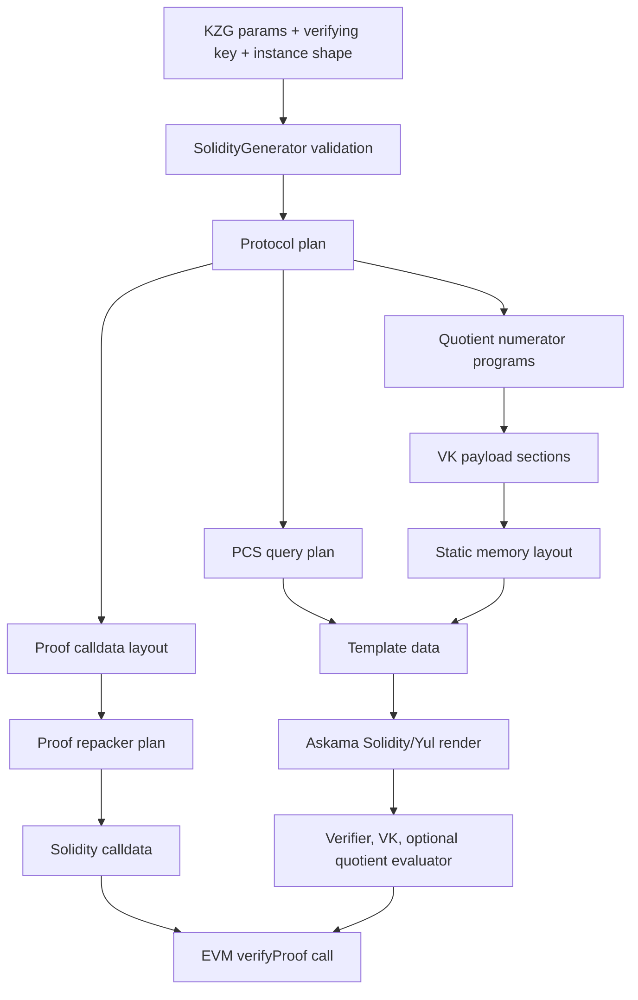

# Halo2 Solidity Verifier Architecture And Codegen Specification

## 1. Purpose

This repository generates Solidity verifiers for a constrained Halo2 verifier
profile used by the Midnight/Midfall stack. The output is not a generic Halo2
verifier generator. It targets a specific proof shape, transcript, polynomial
commitment scheme, and on-chain execution model:

- Halo2 KZG proofs over BLS12-381.
- Midfall/Midnight proof layout and Fiat-Shamir transcript semantics.
- Solidity/Yul verifiers that use the EIP-2537 BLS12-381 precompiles.
- A proof calldata representation suitable for Ethereum ABI transport.
- Optional support for public accumulator verification at the end of the proof.
- Optional trace and gas-checkpoint builds for debugging and benchmarking.

The main user-facing API is `SolidityGenerator`. Given KZG parameters, a
verifying key, and the public instance shape, it validates the circuit profile,
derives a deterministic verifier plan, renders Solidity from Askama/Yul
templates, and provides helper APIs to repack native Halo2 proof bytes into the
generated verifier ABI.

For the audit-facing correctness and security argument, use
[`CODEGEN_ASSURANCE_DOSSIER.md`](./CODEGEN_ASSURANCE_DOSSIER.md). This
architecture document explains how the system is built; the dossier states the
bounded claim, artifact manifest, threat model, and required evidence gates.

## 2. Supported Protocol Envelope

The generator intentionally accepts only the protocol shape it knows how to
verify on-chain.

The verifier currently assumes:

- Exactly one committed instance column and one non-committed public input
  column.
- No rotated instance queries.
- At least one advice column.
- Midfall-compatible KZG transcript behavior.
- BLS12-381 field and curve encodings used by the EIP-2537 precompile ABI.
- A proof layout whose commitment, evaluation, quotient, and accumulator reads
  can be derived statically from the verifying key metadata.

When accumulator support is enabled, the public input tail is expected to carry
a fully collapsed BLS12-381 accumulator in radix-2^56 limbs:

- Left-hand side point coordinates and scalar.
- Right-hand side point coordinates and scalar.
- Seven 56-bit limbs per BLS base-field coordinate.
- Four limbs packed into each public-input field element.
- Ten public-input field elements for the collapsed accumulator words.

This validation is done before rendering. Unsupported circuit shapes should
fail during generator construction instead of producing verifier code that
fails later on-chain.

## 3. Repository Architecture

The codebase is organized around a small public API and a deeper codegen
pipeline.

| Path | Responsibility |
| --- | --- |
| `src/lib.rs` | Public exports, feature flags, calldata helpers, EVM helpers. |
| `src/codegen/mod.rs` | Public codegen types, supported-shape validation, accumulator encoding metadata. |
| `src/codegen/generator.rs` | `SolidityGenerator`, render entrypoints, metadata convergence, VK payload generation, proof repacking. |
| `src/codegen/protocol.rs` | Typed protocol plan derived from the verifying key. |
| `src/codegen/proof_layout.rs` | Static proof calldata and transcript-buffer layout. |
| `src/codegen/template.rs` | Askama template data models and constants. |
| `src/codegen/memory.rs` | Static Yul memory planner and overlap validation. |
| `src/codegen/artifact.rs` | Verifying-key payload sections and packed quotient program encoding. |
| `src/codegen/pcs.rs` | KZG multi-open verifier emitter and pairing-input construction. |
| `src/codegen/evaluator.rs` | Batched identity numerator reconstruction emitter. |
| `src/codegen/quotient/` | Compact quotient numerator VM compiler and metadata. |
| `templates/` | Solidity and Yul template sources consumed by Askama. |
| `tests/` | End-to-end rendering, EVM, trace, gas, and compatibility tests. |
| `docs/` | Design notes, demo runbooks, memory layout, quotient VM, and template mappings. |

The public API deliberately hides most of the planning machinery. Users usually
construct a generator, render Solidity, repack a proof, and submit calldata to
the generated contract. Internally, rendering is a deterministic planning pass
followed by template expansion.

## 4. Public API Surface

The central type is:

```rust
let generator = SolidityGenerator::new(&params, &vk, num_instances, num_committed_instances);
let (verifier_solidity, vk_solidity) = generator.render_separately().unwrap();
```

The important render modes are:

- `render()`: render one Solidity contract with the verifying key embedded.
- `render_separately()`: render a verifier contract and separate verifying-key
  contract.
- `render_trace()` and `render_trace_separately()`: include trace hooks.
- `render_with_gas_checkpoints()` and
  `render_with_gas_checkpoints_separately()`: include section gas checkpoints.
- `render_quotient_evaluator()`: render the external quotient evaluator
  contract for pinned layouts.
- `render_separately_with_pinned_quotient()`: render verifier, VK, and external
  quotient evaluator using a pinned evaluator artifact.

The older unpinned external-quotient render APIs are deprecated and intentionally
panic. External evaluator deployment must be pinned because verifier and
evaluator bytecode must agree exactly on layout, program bytes, constants, and
ABI conventions.

The proof helper API is:

```rust
let calldata = generator.repack_compressed_proof(&native_midfall_proof)?;
```

It converts Midfall/Halo2 proof bytes into the generated Solidity verifier ABI.
The helper performs length checks and applies the same proof-layout plan used by
codegen.

## 5. End-To-End Codegen Pipeline

At a high level, codegen is a sequence of pure planning steps that produce
template data, followed by Askama rendering.



1. Construct `SolidityGenerator`.
2. Validate the verifying-key and instance shape.
3. Build protocol metadata from the Halo2 constraint system.
4. Derive proof read order and proof calldata layout.
5. Derive verifying-key payload layout.
6. Compile compact quotient numerator programs and constants.
7. Compute static Yul memory layout and scratch-space lifetimes.
8. Compute PCS query sets and optional dummy queries.
9. Re-run metadata-dependent passes until sizes and addresses converge.
10. Render Solidity/Yul templates.
11. Repack native proof bytes into Solidity calldata.
12. Deploy the generated contracts and call the verifier entrypoint.

The pipeline is intentionally layout-first. The generated Solidity uses absolute
Yul memory addresses and packed bytecode sections, so the generator must know
all proof, VK, and scratch regions before it can safely emit runtime code.

The most important source-of-truth rule is:

| Concern | Source of truth |
| --- | --- |
| Supported circuit and instance shape | `SolidityGenerator::try_new` and `ConstraintSystemMeta` |
| Proof read order | `ProtocolPlan` and `ProofCalldataLayout` |
| Solidity calldata offsets | `ProofCalldataLayout` and `RepackedProofLayoutPlan` |
| VK bytes and offsets | `VkPayloadLayout` |
| Scratch memory addresses | `VerifierMemoryLayout` |
| Quotient numerator bytecode | `QuotientProgramBuild` |
| PCS query order | `pcs.rs` query planning over the protocol plan |
| Rendered syntax | Askama templates under `templates/` |

## 6. Generator Construction And Validation

`SolidityGenerator::try_new` is the validating constructor. It records:

- KZG parameters.
- Verifying key.
- Public instance counts.
- Number of committed instance columns.
- Optional accumulator encoding.
- Derived constraint-system metadata.

Validation is intentionally early. The generator rejects shapes that would
require runtime behavior the templates do not implement. Examples include
rotated instance queries, missing advice columns, or unsupported public-instance
layouts.

`SolidityGenerator::new` wraps `try_new` and panics on validation failure. Tests
and applications that need recoverable errors should prefer `try_new`.

## 7. Protocol Planning

`src/codegen/protocol.rs` provides the typed source of truth for the verifier
protocol.

The planner derives:

- Commitment read groups.
- Evaluation read groups.
- PCS query sources and order.
- Common polynomial requirements.
- Quotient identity topology.
- Which fixed, advice, instance, and challenge queries are used.
- Challenge and transcript sequencing implied by the proving system.

This mirrors the shape of `snark-verifier`, but avoids relying on an EVM loader
or dynamic unrolled execution model. The result is a static plan that can be
consumed by Rust-side layout code and Askama/Yul templates.

The key design rule is that proof reads are not scattered through templates.
Templates receive an already validated protocol plan, so proof order, transcript
absorbs, quotient identity structure, and PCS query order stay synchronized.

## 8. Proof Layout And ABI

`src/codegen/proof_layout.rs` converts the protocol plan into byte offsets.

The layout replays the verifier's read order:

1. Advice commitments by phase.
2. Lookup multiplicity commitments.
3. Permutation product commitments.
4. Lookup helper and accumulator commitments.
5. Trash commitments.
6. Quotient commitments.
7. Evaluations.
8. `f_com`.
9. Quotient evaluation sets.
10. Public input words.

The generator then derives:

- Total G1 commitment count.
- Total scalar/evaluation count.
- Group boundaries for transcript absorbs.
- Offsets used by the Solidity verifier.
- A `RepackedProofLayoutPlan` for native-proof to calldata conversion.

The native compressed proof uses compact BLS12-381 encodings. The generated
Solidity verifier expects EIP-2537-style padded coordinates. During repacking,
compressed G1 commitments are decompressed into four 32-byte words:

- `x_hi`
- `x_lo`
- `y_hi`
- `y_lo`

Scalar words are converted into the big-endian field representation expected by
the generated verifier. The repacker also preserves the generator's exact
ordering for commitment groups, evaluations, quotient material, and public
inputs.

## 9. Verifying-Key Artifact Layout

`src/codegen/artifact.rs` defines the typed payload layout for generated VK
artifacts.

The VK payload is split into monotonic sections:

- Header.
- Compact quotient constants.
- Compact quotient programs.
- Fixed commitments.
- Permutation commitments.

The generator first reserves space for quotient constants and program bytes,
then compiles the compact quotient programs, fills the reserved sections, and
validates the resulting `VkPayloadLayout`.

The compact quotient VM bytecode is packed into big-endian U256 words. Padding
is explicit and checked on decode, which keeps the Solidity-side byte slicing
predictable.

Before bytecode is written into the VK payload, the generator re-decodes the
final physical program and validates opcode support, operand length, memory
tokens, stack depth, and identity-boundary emptiness. This keeps the lean Yul VM
from depending on unchecked generator assumptions.

Separated verifier mode emits a verifier contract plus a VK contract. Embedded
mode emits one contract with the VK constants in the same artifact. The runtime
protocol is the same in both modes.

## 10. Memory Model

The generated verifier is written for predictable, low-overhead Yul execution.
It does not rely on Solidity's free-memory pointer for its main work areas.
Instead, `src/codegen/memory.rs` assigns absolute memory ranges at codegen time.

Each range has:

- A symbolic name.
- A start address.
- A byte length.
- A lifetime phase.
- A reuse policy.

The planner rejects overlapping ranges whose lifetimes can coexist. Scratch
regions may intentionally reuse the same addresses only when their phases are
disjoint.

Important phases include:

- Transcript.
- Quotient VM.
- Fixed PCS preparation.
- Final PCS MSM.
- PCS pairing.
- Accumulator MSM.
- Accumulator pairing batch.
- Final pairing.
- Verifier return.
- Quotient return.

This static memory model is one of the central design constraints of the
codebase. If a template needs new scratch memory, it should be added to the
memory planner rather than hard-coded directly into Yul.

## 11. Metadata Convergence

Several generated sizes depend on earlier generated artifacts:

- VK payload size depends on compact quotient constants and program bytes.
- Memory base addresses depend on VK payload size.
- PCS dummy query count depends on protocol metadata and feature flags.
- Template scratch requirements depend on finalized memory addresses.

`generator.rs` handles these dependencies with bounded convergence loops. It
builds provisional metadata, derives sizes, rebuilds with the new sizes, and
checks that the stable static layout has converged. If section sizes do not
settle within the allowed iteration count, generation fails instead of emitting
ambiguous bytecode.

## 12. Quotient Numerator Codegen

The quotient system in `src/codegen/quotient/` compiles Halo2 quotient numerator
logic into a compact VM representation.

The compiler:

- Lowers gate, permutation, lookup, and trash identities.
- Assigns constants.
- Performs common-subexpression handling where supported.
- Emits bytecode and constant tables.
- Tracks maximum stack depth.
- Tracks memory tokens and native callback requirements.
- Preserves the identity stream order expected by Midfall.

At runtime, the Yul quotient VM reconstructs the batched identity numerator.
The emitted verifier stores the negative numerator value as the expected opening
scalar, while the commitment side carries the `(1 - x^n)` factor.

The codebase uses two related but distinct pieces:

- `quotient/`: compiler for compact numerator programs.
- `evaluator.rs`: Yul emitter for batched identity numerator reconstruction and
  linearization-related scalar preparation.

The quotient evaluator is not an arbitrary Solidity subroutine. It is tied to a
specific proof layout, VK layout, transcript schedule, and quotient program
artifact.

## 13. PCS Codegen

`src/codegen/pcs.rs` emits the KZG multi-open verifier logic. It mirrors the
Midfall `multi_prepare` flow in Yul.

The generated PCS path:

1. Builds the verifier query list.
2. Constructs intermediate point sets.
3. Sorts sets by ascending cardinality where required.
4. Precomputes rotation points `x * omega^rot`.
5. Computes powers of challenge `x1`.
6. Folds quotient evaluations into query commitments.
7. Materializes `q_com` inputs.
8. Computes `f_eval` by Lagrange interpolation at `x3`.
9. Computes the final commitment with `x4` powers, `f_com`, and `v`.
10. Constructs pairing inputs `(pi, final_com - vG + x3*pi)`.

Feature flags can adjust this path. For example, fewer point sets can introduce
dummy evaluations so the generated verifier keeps a compact, stable query shape.

## 14. Transcript And Challenge Flow

The generated verifier follows the Midfall transcript order. Commitments,
instances, evaluations, quotient material, and accumulator material must be read
and absorbed in the same order used by proof generation.

For Moonlight wrap proofs and IVC final proofs, the relevant integration path
uses the special Midfall Keccak transcript:

```rust
CircuitTranscript<sha3::Keccak256>
```

This matters because a proof generated with a different transcript hash will
not verify on-chain even if the circuit, VK, and calldata layout are otherwise
correct. The Solidity verifier assumes the Keccak transcript schedule emitted
by this codegen path.

## 15. Generated Solidity Runtime

The rendered Solidity contract is mostly a small ABI shell around Yul verifier
logic.

Runtime execution follows this shape:

1. Validate calldata shape.
2. Load or reference the verifying-key payload.
3. Prevalidate public accumulator material, when enabled, before transcript,
   quotient, PCS, and final pairing work.
4. Initialize transcript memory.
5. Absorb VK digest, committed public input material, and instance material.
6. Read proof commitments and evaluations into the static proof layout.
7. Squeeze challenges in the expected order.
8. Reconstruct quotient numerator and linearization scalars.
9. Run PCS multi-open preparation.
10. Optionally batch the already-validated public accumulator equation into the
    final pairing inputs.
11. Run final pairing checks through EIP-2537 precompiles.
12. Return the verifier result.

Gas-checkpoint builds insert measurement points into this flow. Trace builds
insert diagnostic events or hooks. These modes should not change the verifier's
semantic result.

## 16. Accumulator Verification

Accumulator support is represented by `AccumulatorEncoding`.

When enabled, the generator knows how to locate packed accumulator limbs in the
public input tail. The generated verifier unpacks this data and routes each
decoded carried point through EIP-2537 G1MSM near the start of verification,
then later batches the resulting accumulator pairing equation with the
verifier's KZG pairing path.

Two public-input accumulator layouts are supported:

- `AccumulatorEncoding::new(...)`: Midfall IVC-style accumulator input,
  encoded as `lhs point, lhs scalar, rhs point, rhs scalar`, with an optional
  fixed-base scalar tail.
- `AccumulatorEncoding::point_pair(...)`: already-collapsed Moonlight wrap
  input, encoded as `lhs point, rhs point`; the generated verifier treats both
  carried scalars as one and rejects fixed-base scalar tails for this layout.

The accumulator layout is intentionally explicit because public input packing is
part of the on-chain ABI. Any change to limb count, limb width, point order, or
public-input placement must update both the Rust-side encoder and the generated
Solidity reader.

## 17. Template System

Templates live under `templates/` and are rendered through Askama. The Rust
side should do planning; templates should consume facts.

That means templates generally receive:

- Protocol read plans.
- Proof offsets.
- Memory addresses.
- VK section offsets.
- Quotient program metadata.
- PCS query metadata.
- EIP-2537 constants.
- Feature flags and trace/gas instrumentation settings.

Templates should avoid rediscovering layout rules. When a template needs a new
address, byte offset, query count, or section length, add that concept to the
Rust-side model first.

## 18. Feature Flags And Build Modes

The public feature constants exported from `src/lib.rs` let tests and generated
artifacts know which codegen paths are active.

Important modes include:

- Solidity trace instrumentation.
- Solidity gas checkpoints.
- Truncated challenges.
- Outer fewer point sets.
- Outer single `h` commitment.
- EVM test support.

Feature flags are part of the generated verifier's behavior. A proof produced
for one verifier shape may not be valid for a verifier rendered with a different
feature set.

## 19. Testing And Bench Strategy

The repository tests the generator through several layers:

- Rust unit tests for layout, packing, and helper APIs.
- Solidity rendering tests.
- EVM deployment and verification tests.
- Trace builds for debugging challenge and proof-read mismatches.
- Gas checkpoint builds for section-level profiling.
- IVC and Moonlight integration benches for realistic proof shapes.

Representative local commands:

```bash
cargo test --lib
```

```bash
cargo test --features evm --test codegen
```

```bash
MOONLIGHT_RUN_WRAP_SOLIDITY_BENCH=1 \
cargo test --manifest-path /Users/Julien.Coolen/Moonlight/aggregation/Cargo.toml \
  wrap_circuit_composes_two_fold_children_from_four_dummy_fold_proofs --release \
  --lib -- --ignored --nocapture
```

The Moonlight command runs from this repository's Solidity verifier integration
when Moonlight has a local path dependency pointing back to this checkout. It
generates Moonlight wrap proof material, repacks it for the Solidity verifier,
deploys the generated verifier path, and checks the proof on-chain in the local
EVM harness.

## 20. Extension Guidelines

When extending codegen, keep changes anchored in the planner before touching
templates.

For a new proof read:

1. Add it to the typed protocol plan.
2. Add offsets to `ProofCalldataLayout`.
3. Update the repacker.
4. Expose the offset through template data.
5. Update trace and gas-checkpoint builds.
6. Add an EVM or layout test.

For a new VK section:

1. Add a typed section to `VkPayloadLayout`.
2. Include it in payload convergence.
3. Validate section offsets and padding.
4. Update embedded and separated render modes.
5. Add decode or byte-layout tests.

For new Yul scratch memory:

1. Add a named range to `VerifierMemoryLayout`.
2. Assign the correct `MemoryPhase`.
3. Let the overlap checker validate reuse.
4. Thread the address through `template.rs`.
5. Avoid hard-coded addresses in templates.

For quotient VM changes:

1. Extend the opcode, token, or constant model in Rust.
2. Update the packed-program codec if byte encoding changes.
3. Update the physical-program safety validator.
4. Update the runtime Yul VM.
5. Add bytecode round-trip and safety tests.
6. Add an end-to-end verifier test for the affected identity shape.

For transcript changes:

1. Update the Rust-side transcript schedule.
2. Update Solidity/Yul absorbs and squeezes.
3. Update proof generation to use the same transcript.
4. Add a negative test showing mismatched transcripts fail.
5. Re-run a real proof bench, not only a rendering test.

## 21. Design Invariants

The implementation relies on these invariants:

- Rust planning is the source of truth for layout.
- Templates render already planned data.
- Proof repacking and generated Solidity share one proof-layout plan.
- VK payload offsets are typed and validated.
- Yul memory addresses are planned and overlap-checked.
- External quotient evaluators are pinned to the verifier artifact.
- Transcript order must match proof generation exactly.
- EIP-2537 field and curve encodings are ABI, not implementation detail.
- Gas and trace instrumentation must not change verifier semantics.

These invariants are more important than any individual template. Most verifier
bugs come from letting two parts of the stack make independent assumptions about
proof order, memory addresses, transcript absorbs, or public input packing.

## 22. Related Documents

This specification is the architectural overview. More focused details live in:

- `docs/HALO2_MIDNIGHT_VERIFIER_SPEC.md`
- `docs/MEMORY_LAYOUT.md`
- `docs/ASKAMA_TEMPLATE_RUST_MAPPING.md`
- `docs/QUOTIENT_NUMERATOR_EVALUATOR.md`
- `docs/QUOTIENT_EVALUATOR_9KB_BYTECODE.md`
- `docs/TEAM_DEMO_SETUP.md`
